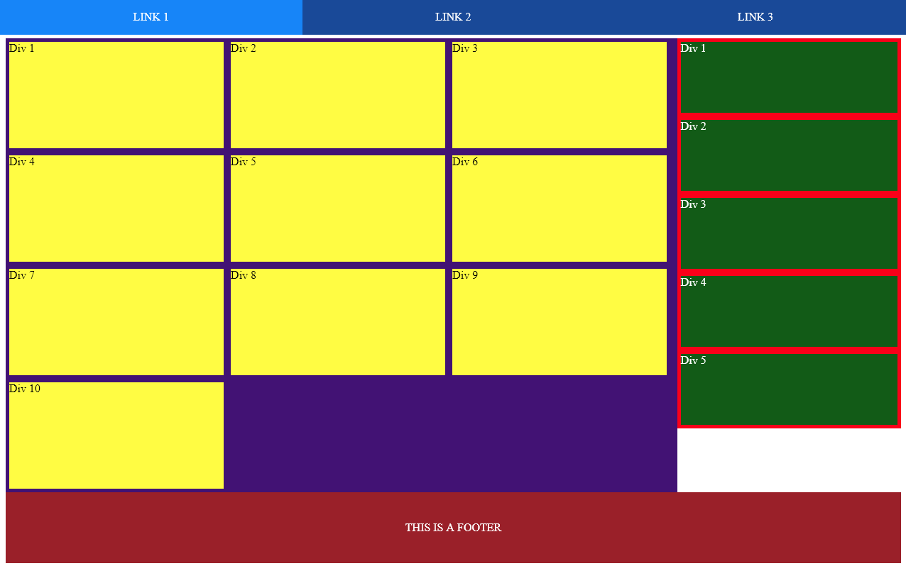
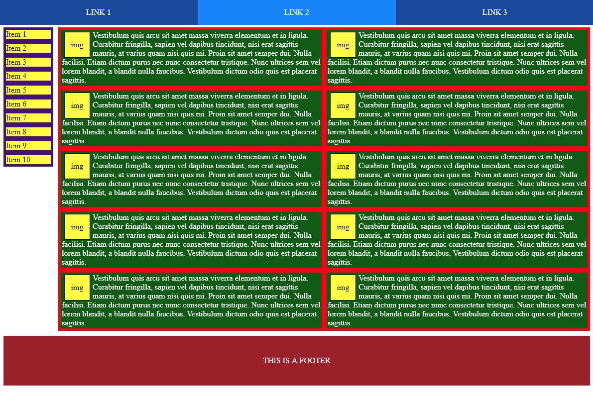
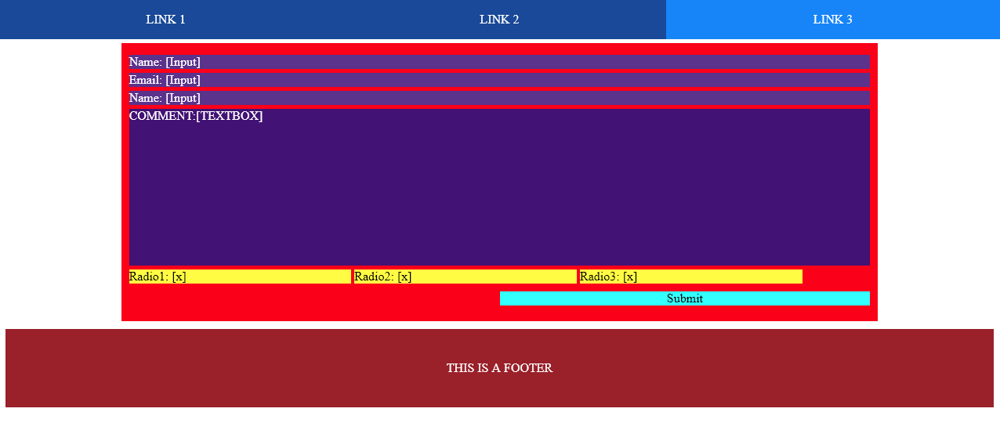

# General Instructions:

You will be building a three page website for a fictitious company.
Each page has a specific setup guide that should be followed. Each page description
has the _minimum_ that needs to be completed for each page. You can do more styling
or more media queries for each (and I recommend you do) if you have time. If you have an actual idea in mind as opposed to building a site with fake data, let your instructor know as it might be better for you to use this to build a site you might use.

## Guidelines:

- Follow DRY CSS principles whenever possible (think: "Can I reuse this?")
- Use at least three different fonts with at least one coming from the Google fonts API
- You should have only one css file (excluding google fonts api file) that you reuse on all three pages with no styling in the head.
- Don't copy any css or html code from earlier work (with the exception of the standard boilerplate HTML)
- Ask questions if you need help.
- Pick colors that you think work well together - they don't have to be perfect.
- Try to get started with just the instructions below but if you get stuck feel free to see the mock-ups included in this folder (and shown in this document). Bear in mind that the images shown are ONLY shown as they would appear at a large resolution. Ensure that they are mobile friendly in their design using the patterns / tools we have learned thus far.

# Page Instructions:

## All Pages:

All pages should have the same menu and footer styled as follows:

#### Menu:

- There need to be three menu items with each one linking to the other two pages.
- The one for the page you're currently on should have a different color than the others and not link anywhere.
- Both of the non-current links should change color when you hover over them.

#### Footer:

- The Footer should have your company information (can be filler or made up) and include an image.
- Styling should be however you see fit but there should be whitespace between the body content and the footer

## First Page

The first page will be your "Main Page" and can be named however you see fit for the links going to it.
The "Main Page" should be separated into two distinct sections and should be styled as follows.

#### Main Section:

- The main section should take up the majority of the page at larger resolutions (can be 60%-80% as you prefer)
- At smaller resolutions it should take up the entire width of the page.
- It should contain _at least_ 10 sub sections displayed in rows.
- The number of sub sections per row should change based off screen width.
- Regardless of number of subsections per row, all items on each row should have the same height and should scale together as needed.

#### Side Section:

- The side section should take up the remainder of the screen and be right next to the main section at larger resolutions.
- At smaller resolutions, the side section should also take up 100% of the screen width and should be below the main section.
- It should contain _at least_ 5 sub sections taking up the full width at lower resolutions.
- At higher resolutions the sub sections should take less width depending on how you feel it looks best.

#### Both Sections:

- Use whatever filler text you prefer for all subsections.
- Each subsection should have a different amount of filler text to make sure their height scales regardless of content.

## Second Page

The second Page should be an "Items for Sale Page" (named however you prefer for the links). It should be broken up
into two distinct sections and styled as outlined below.

#### Side Menu:

- There should be a menu on either the right or left (your choice)
- It should remain a static width at all resolutions (use whatever minimum width you feel would work best)
- The side menu should have 10 links in a column, with each link corresponding to an item in the main section (see below)
- When you click on a link, it should take you to the corresponding item in the main section (internal link)

#### Main Section

- The remainder of the page should be taken up by items for sale with a small amount of whitespace between the main section and the menu.
- Each item should correspond to a link on the side menu.
- The items should be displayed in rows or a single column depending on the best view for the screen resolution.
- When displayed in rows, all items in a given row should match each other in height and grow/shrink as needed.
- Each item should contain a picture and a description (use whatever filler you prefer but make them of varying lengths.)
- When a user hovers over a picture, it should scale in size as you see fit.
- At the bottom of each item container should be a link to return you to the top of the side menu. (think: "Go To Item Menu")

## Third Page

The third page should be a contact page (titled however you see fit in the links). It is going to consist of a single
form styled as outlined below.

#### Form

- The form should consist of the following pieces including labels for each:
  - Text input for name
  - Text input for email
  - Comment section (larger text area box)
  - Reason for contacting which should consist of three radio buttons: Complaint, Suggestion, Question
- There should be a submit button to the lower right of the form (this won't do anything yet)
- Each item on the form should be neatly organized but you don't have to use field sets.

# Final Notes:

The above is once again the _minimum_ you should accomplish for this project. It seems like a rather daunting task
but you know all of the skills you need to complete it. Don't be afraid to ask questions of anyone in the class if you need help.
If you happen to reach the end before others, feel free to add more functionality or offer assistance to your classmates.
Remember, we're all in this together!

Due date: February 27th 5:30
